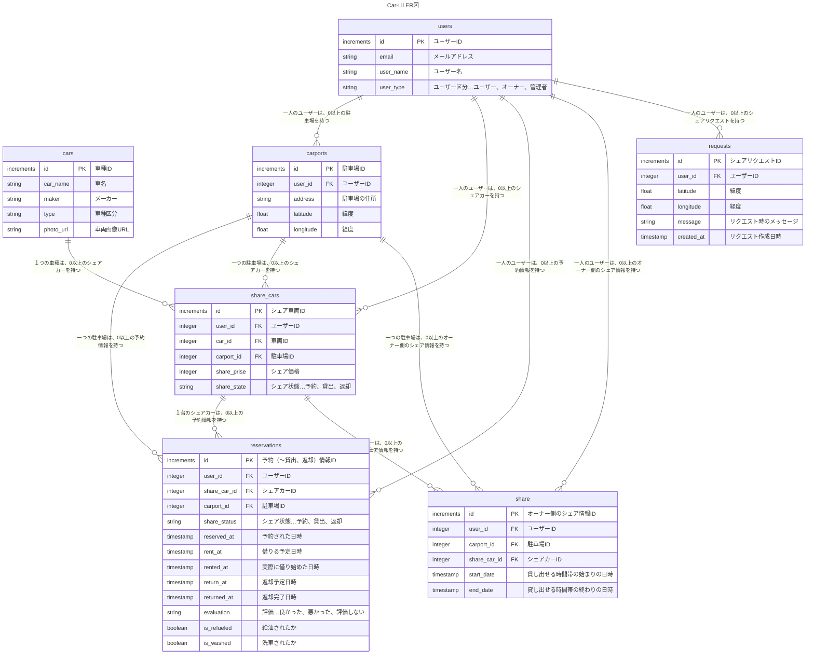

# ER図

```mermaid
---
title: "Car-Lil ER図"
---
erDiagram

users {
    increments id PK "ユーザーID"
    string email "メールアドレス"
    string user_name "ユーザー名"
    string user_type "ユーザー区分…ユーザー、オーナー、管理者"
}

cars {
    increments id PK "車種ID"
    string car_name "車名"
    string maker "メーカー"
    string type "車種区分"
    string photo_url "車両画像URL"
}

carports {
    increments id PK "駐車場ID"
    integer user_id FK "ユーザーID"
    string address "駐車場の住所"
    float latitude "緯度"
    float longitude "経度"
}

share_cars {
    increments id PK "シェア車両ID"
    integer user_id FK "ユーザーID"
    integer car_id FK "車両ID"
    integer carport_id FK "駐車場ID"
    integer share_prise "シェア価格"
    string share_state "シェア状態…予約、貸出、返却"
}

reservations {
    increments id PK "予約（〜貸出、返却）情報ID"
    integer user_id FK "ユーザーID"
    integer share_car_id FK "シェアカーID"
    integer carport_id FK "駐車場ID"
    string share_status "シェア状態…予約、貸出、返却"
    timestamp reserved_at "予約された日時"
    timestamp rent_at "借りる予定日時"
    timestamp rented_at "実際に借り始めた日時"
    timestamp return_at "返却予定日時"
    timestamp returned_at "返却完了日時"
    string evaluation "評価…良かった、悪かった、評価しない"
    boolean is_refueled "給油されたか"
    boolean is_washed "洗車されたか"
}

share {
    increments id PK "オーナー側のシェア情報ID"
    integer user_id FK "ユーザーID"
    integer carport_id FK "駐車場ID"
    integer share_car_id FK "シェアカーID"
    timestamp start_date "貸し出せる時間帯の始まりの日時"
    timestamp end_date "貸し出せる時間帯の終わりの日時"
}

requests {
    increments id PK "シェアリクエストID"
    integer user_id FK "ユーザーID"
    float latitude "緯度"
    float longitude "経度"
    string message "リクエスト時のメッセージ"
    timestamp created_at "リクエスト作成日時"
}

users ||--o{ carports : "一人のユーザーは、0以上の駐車場を持つ"
users ||--o{ share_cars : "一人のユーザーは、0以上のシェアカーを持つ"
users ||--o{ reservations : "一人のユーザーは、0以上の予約情報を持つ"
users ||--o{ share : "一人のユーザーは、0以上のオーナー側のシェア情報を持つ"
users ||--o{ requests : "一人のユーザーは、0以上のシェアリクエストを持つ"

cars ||--o{ share_cars : "１つの車種は、0以上のシェアカーを持つ"

carports ||--o{ reservations : "一つの駐車場は、0以上の予約情報を持つ"
carports ||--o{ share_cars : "一つの駐車場は、0以上のシェアカーを持つ"
carports ||--o{ share : "一つの駐車場は、0以上のオーナー側のシェア情報を持つ"

share_cars ||--o{ reservations : "１台のシェアカーは、0以上の予約情報を持つ"
share_cars ||--o{ share : "１台のシェアカーは、0以上のオーナー側のシェア情報を持つ"
```